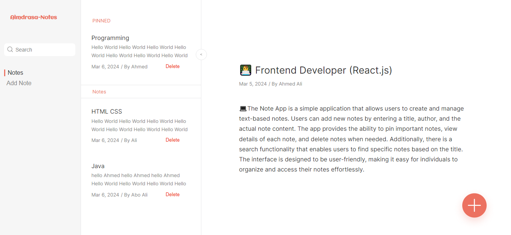

# Note App

This is a simple Notes App project built using HTML, CSS, and JavaScript. The application allows users to add notes, delete and search.



## [Live Site](https://ahmed-ali-9-6.github.io/Note-App/)

## [Figma Dsign](https://www.figma.com/file/FSzGesa0hMQsYPd1B41s8F/Note-app-almdrasa-js-diploma-project?type=design&node-id=0-1&mode=design&t=q4qXoR5CmH9Wfk9T-0)

## Technologies Used

 


## Table of Contents

- [Features](#features)
- [Installation](#installation)
- [Usage](#usage)
- [Contact](#contact)

## Features

- **Add Note**: Users can add new notes with a title, author, and details.
- **Delete Note**: Notes can be deleted individually.
- **Search**: Users can search for specific notes using keywords.
- **LocalStorage**: Notes are saved in the browser's localStorage for persistence.

## Installation

To run this project locally, follow these steps:

1. Clone the repository:

   ```bash
   git clone https://github.com/ahmed-ali-9-6/Note-App
   ```

2. Navigate to the project directory:

   ```bash
   cd Note-App
   ```

3. Open the `index.html` file in your preferred web browser.

## Usage

- **Adding a Note**: Click on the "Add Note" button and fill in the title, author, and details of the note. Then, click "Add Note" or "Add Pinned Note" to add the note.
- **Deleting a Note**: Click on the "Delete" button next to the note you want to delete.
- **Searching for Notes**: Type keywords in the search bar to filter notes. Matching notes will be highlighted.
- **Viewing Note Details**: Click on a note's title to view its details in the blog section.

## Contact

- [Author](https://github.com/ahmed-ali-9-6)
- [Website](https://ahmed-ali-9-6.github.io/My-Portfolio/)
- [Email](mailto:ahmed.ali.hassan108@gmail.com)
- [LinkedIn](https://www.linkedin.com/in/ahmed-ali-993011215/)
